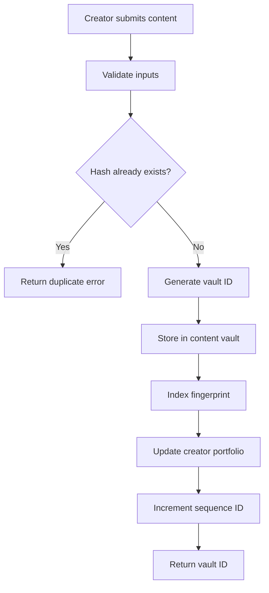
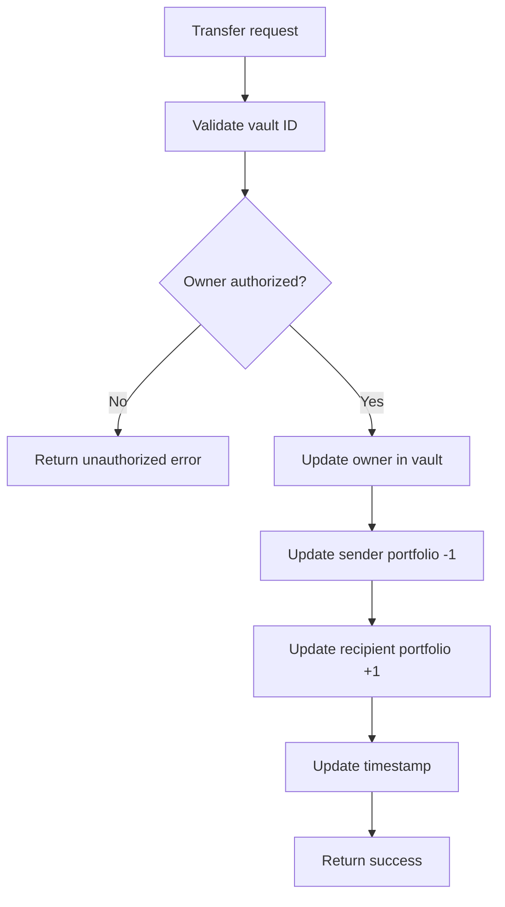

# StacksVault - Decentralized Content Registry

[](https://clarity-lang.org/)
[](https://stacks.co/)
[](LICENSE)

A sophisticated smart contract for registering, managing, and verifying digital content ownership on the Stacks blockchain. StacksVault enables creators to establish immutable proof of ownership for their digital works while leveraging Bitcoin's security through the Stacks protocol.

## 🌟 Key Features

- **Cryptographic Content Fingerprinting**: SHA-256 hash-based content identification
- **Decentralized Ownership Verification**: No intermediaries required for ownership validation
- **Seamless Content Transfers**: Automatic ownership transfer with complete audit trail
- **Gas-Efficient Storage**: Optimized data structures for Stacks blockchain
- **Content Lifecycle Management**: Archive/activate content with status tracking
- **Portfolio Analytics**: Real-time creator statistics and content counting

## 🏗️ System Overview

StacksVault operates as a decentralized registry that creates immutable records of digital content ownership. The system uses cryptographic fingerprinting to ensure content uniqueness and provides a complete audit trail for ownership transfers.

### Architecture Components

```
┌─────────────────────────────────────────────────────────────┐
│                    StacksVault Contract                     │
├─────────────────────────────────────────────────────────────┤
│                                                             │
│  ┌─────────────────┐  ┌─────────────────┐  ┌──────────────┐ │
│  │ Content Registry│  │ Fingerprint     │  │ Creator      │ │
│  │                 │  │ Index           │  │ Portfolio    │ │
│  │ • Vault ID      │  │                 │  │              │ │
│  │ • Owner         │  │ • Hash → ID     │  │ • Owner      │ │
│  │ • Metadata      │  │ • Duplicate     │  │ • Count      │ │
│  │ • Timestamps    │  │   Prevention    │  │ • Analytics  │ │
│  │ • Status        │  │                 │  │              │ │
│  └─────────────────┘  └─────────────────┘  └──────────────┘ │
│                                                             │
├─────────────────────────────────────────────────────────────┤
│                    Core Functions                          │
├─────────────────────────────────────────────────────────────┤
│                                                             │
│  ┌────────────────┐ ┌─────────────────┐ ┌─────────────────┐ │
│  │ Registration   │ │ Transfer        │ │ Query           │ │
│  │                │ │                 │ │                 │ │
│  │ • Validate     │ │ • Authorization │ │ • By Vault ID   │ │
│  │ • Store        │ │ • Update Owner  │ │ • By Hash       │ │
│  │ • Index        │ │ • Portfolio     │ │ • Ownership     │ │
│  │ • Increment    │ │ • Audit Trail   │ │ • Portfolio     │ │
│  └────────────────┘ └─────────────────┘ └─────────────────┘ │
│                                                             │
└─────────────────────────────────────────────────────────────┘
```

## 📊 Contract Architecture

### Data Structures

#### Primary Content Registry (`digital-content-vault`)

```clarity
{
  vault-id: uint                           // Unique content identifier
} →
{
  content-owner: principal,                // Current owner address
  asset-title: (string-ascii 256),         // Content title
  asset-description: (string-ascii 1024),  // Content description
  cryptographic-fingerprint: (buff 32),    // SHA-256 hash
  media-category: (string-ascii 64),       // Content category
  registration-block: uint,                // Initial registration block
  last-modified-block: uint,               // Last update block
  vault-status: bool,                      // Active/archived status
}
```

#### Fingerprint Index (`fingerprint-index`)

```clarity
{
  cryptographic-fingerprint: (buff 32)     // SHA-256 hash
} →
{
  vault-id: uint                           // Associated vault ID
}
```

#### Creator Portfolio (`creator-portfolio`)

```clarity
{
  content-owner: principal                 // Creator address
} →
{
  registered-count: uint                   // Total registered content
}
```

### State Variables

- `content-sequence-id`: Auto-incrementing counter for vault IDs
- `VAULT-ADMIN`: Contract deployment authority (immutable)

## 🔄 Data Flow

### Content Registration Process



### Ownership Transfer Process



## 🚀 Quick Start

### Prerequisites

- [Clarinet](https://github.com/hirosystems/clarinet) - Stacks development environment
- [Node.js](https://nodejs.org/) v18+ - For running tests
- [Git](https://git-scm.com/) - Version control

### Installation

```bash
# Clone the repository
git clone https://github.com/abdulbasit-hash/stacks-vault.git
cd stacks-vault

# Install dependencies
npm install

# Check contract syntax
clarinet check

# Run tests
npm test

# Run tests with coverage
npm run test:report
```

### Development Commands

```bash
# Format contracts
clarinet fmt --in-place

# Start local development environment
clarinet integrate

# Watch tests during development
npm run test:watch
```

## 📋 API Reference

### Public Functions

#### `register-digital-asset`

Register new digital content with cryptographic proof of ownership.

```clarity
(register-digital-asset
  (asset-title (string-ascii 256))
  (asset-description (string-ascii 1024))
  (cryptographic-fingerprint (buff 32))
  (media-category (string-ascii 64))
)
```

**Parameters:**

- `asset-title`: Content title (1-256 characters)
- `asset-description`: Content description (0-1024 characters)
- `cryptographic-fingerprint`: SHA-256 hash (32 bytes)
- `media-category`: Content category (1-64 characters)

**Returns:** `(ok vault-id)` or error code

#### `transfer-content-ownership`

Transfer content ownership between Stacks addresses.

```clarity
(transfer-content-ownership
  (vault-id uint)
  (recipient principal)
)
```

**Parameters:**

- `vault-id`: Unique content identifier
- `recipient`: New owner's Stacks address

**Returns:** `(ok true)` or error code

#### `update-asset-metadata`

Update content metadata while preserving ownership and cryptographic proof.

```clarity
(update-asset-metadata
  (vault-id uint)
  (asset-title (string-ascii 256))
  (asset-description (string-ascii 1024))
)
```

#### `archive-digital-content`

Archive content by setting inactive status.

```clarity
(archive-digital-content (vault-id uint))
```

### Read-Only Functions

#### `get-vault-record`

Retrieve complete content record by vault ID.

```clarity
(get-vault-record (vault-id uint))
```

#### `lookup-by-fingerprint`

Lookup content using its cryptographic fingerprint.

```clarity
(lookup-by-fingerprint (cryptographic-fingerprint (buff 32)))
```

#### `verify-content-ownership`

Verify ownership claims for any registered content.

```clarity
(verify-content-ownership (vault-id uint) (alleged-owner principal))
```

#### `get-creator-portfolio-size`

Get creator's total registered content count.

```clarity
(get-creator-portfolio-size (content-owner principal))
```

#### `is-vault-active`

Check if content is active and available.

```clarity
(is-vault-active (vault-id uint))
```

#### `get-next-vault-id`

Get the next available vault ID for registration.

```clarity
(get-next-vault-id)
```

#### `is-fingerprint-available`

Validate that a cryptographic fingerprint is available for registration.

```clarity
(is-fingerprint-available (cryptographic-fingerprint (buff 32)))
```

## ⚠️ Error Codes

| Code | Constant | Description |
|------|----------|-------------|
| 100 | `ERR-UNAUTHORIZED-ACCESS` | Caller not authorized for operation |
| 101 | `ERR-CONTENT-NOT-REGISTERED` | Vault ID does not exist |
| 102 | `ERR-DUPLICATE-CONTENT-HASH` | Content hash already registered |
| 103 | `ERR-MALFORMED-INPUT` | Invalid input parameters |
| 104 | `ERR-OPERATION-FAILED` | General operation failure |
| 105 | `ERR-INVALID-VAULT-ID` | Vault ID out of valid range |

## 🔒 Security Features

### Input Validation

- String length validation for all text inputs
- Buffer size validation for cryptographic hashes
- Numeric range validation for vault IDs
- Duplicate prevention through fingerprint indexing

### Access Control

- Owner-only operations for content modification
- Immutable contract admin designation
- Authorization checks on all state-changing functions

### Data Integrity

- Cryptographic fingerprinting for content verification
- Immutable ownership history on blockchain
- Timestamp tracking for audit trails

## 🧪 Testing

The project includes comprehensive test suites using Vitest and Clarinet SDK:

```bash
# Run all tests
npm test

# Run tests with coverage and gas cost analysis
npm run test:report

# Watch mode for development
npm run test:watch
```

### Test Coverage Areas

- Content registration workflows
- Ownership transfer scenarios
- Metadata update operations
- Archive/activation functionality
- Query function validation
- Error condition handling
- Gas optimization verification

## 🤝 Contributing

1. Fork the repository
2. Create a feature branch (`git checkout -b feature/amazing-feature`)
3. Commit your changes (`git commit -m 'Add amazing feature'`)
4. Push to the branch (`git push origin feature/amazing-feature`)
5. Open a Pull Request

### Development Guidelines

- Follow Clarity best practices
- Maintain comprehensive test coverage
- Document all public functions
- Use descriptive variable names
- Optimize for gas efficiency

## 📄 License

This project is licensed under the ISC License - see the [LICENSE](LICENSE) file for details.

## 🔗 Links

- [Stacks Documentation](https://docs.stacks.co/)
- [Clarity Language Reference](https://docs.stacks.co/clarity)
- [Clarinet Documentation](https://github.com/hirosystems/clarinet)
- [Stacks Explorer](https://explorer.stacks.co/)
